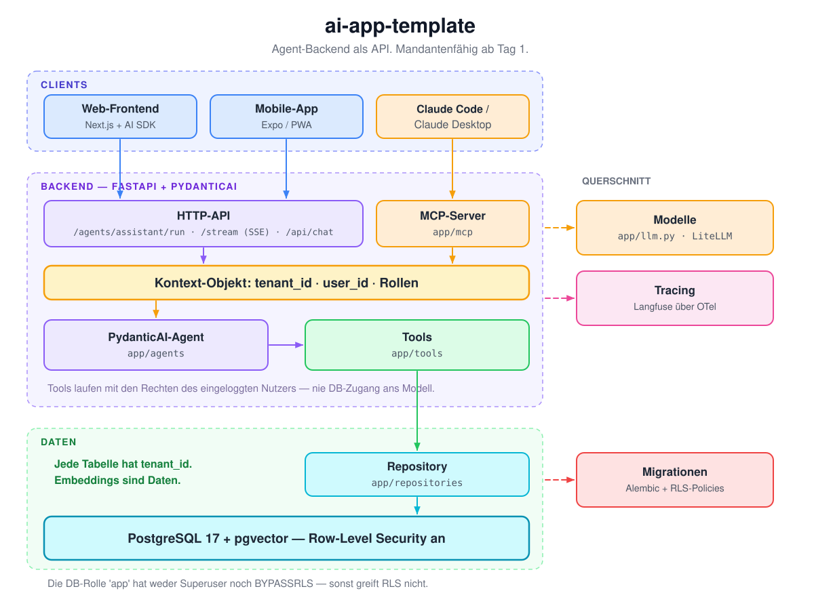

# ai-app-template

Grundgerüst für Apps mit KI-Agenten: **Agent-Backend als API**, mandantenfähig ab Tag 1 – ohne dass
es beim ersten Mandanten im Weg steht. Blueprint A aus dem Claude-Code-Skill
**[ai-app-architecture](https://github.com/JulesCyb/claude-skills)**.

<p align="center">
  
</p>

<p align="center"><sub><a href="https://excalidraw.com/#json=Z_ifrAF0bmMFKJjkR-FkY,U93eAVSml9yG5JK2a5c95g">Diagramm in Excalidraw öffnen und bearbeiten</a></sub></p>

> **Stand: 2026-08** (PydanticAI 2.x, MCP-SDK 2.x, FastAPI 0.14x). Vor dem Ableiten
> `uv lock --upgrade` laufen lassen und die Modellnamen in `.env.example` sowie
> `docker/litellm/config.yaml` aktualisieren.

---

## Die Idee in vier Sätzen

Die Agent-Logik läuft als eigener Dienst mit HTTP-API – Web-Frontend, Mobile-App und Claude Code
sind einfach drei Clients derselben Schnittstelle. Jeder Request erzeugt ein **Kontext-Objekt**
(`tenant_id`, `user_id`, Rollen), das durch Agent, Tools, Repository und bis in die
Datenbanktransaktion gereicht wird; nichts liest globalen Zustand. In der Datenbank sichert
**Row-Level Security** die Mandantentrennung ab, nicht die Sorgfalt des Entwicklers. Und der Agent
sieht nie eine DB-Verbindung – er kommt ausschließlich über Tools an Daten, die mit den Rechten des
eingeloggten Nutzers laufen.

## Schnellstart

```bash
uv sync --group dbtest              # dbtest nur, wenn du den echten RLS-Test willst
cp .env.example .env                # Keys und Modellnamen eintragen
docker compose up -d postgres
uv run alembic upgrade head
uv run python scripts/seed.py "Mein Mandant" me@example.com   # gibt Tenant-/User-ID aus
uv run uvicorn app.main:app --reload
```

Erster Aufruf (lokal reichen Dev-Header):

```bash
curl -X POST localhost:8000/agents/assistant/run \
  -H 'Content-Type: application/json' \
  -H 'X-Tenant-Id: <TENANT>' -H 'X-User-Id: <USER>' \
  -d '{"prompt": "Was steht in meinen Dokumenten zu Kündigungsfristen?"}'
```

Tests: `uv run pytest` – der RLS-Integrationstest wird übersprungen, wenn `pgserver` fehlt.

## Was drin ist

| Baustein | Datei | Zweck |
|---|---|---|
| Kontext-Objekt | `app/context.py` | `tenant_id`, `user_id`, Rollen – wird überall durchgereicht |
| Auth (dev) | `app/deps.py` | `X-Tenant-Id`/`X-User-Id`-Header lokal; JWT-Stelle vorbereitet |
| Mandanten-Session | `app/db/session.py` | `set_config('app.tenant_id', …)` pro Transaktion |
| Schema + RLS | `migrations/versions/0001_initial.py` | tenants, users, documents (vector 1536), Policies, Grants |
| App-Rolle | `docker/postgres/01-init.sh` | `app` ohne Superuser/BYPASSRLS – sonst greift RLS nicht |
| Repository | `app/repositories/documents.py` | einziger Weg zur DB, Vektorsuche |
| Tools | `app/tools/documents.py` | Suche mit Kontext, gemeinsam für Agent und MCP |
| Agent | `app/agents/assistant.py` | PydanticAI-Agent, Modell zur Laufzeit, Tracing-Metadaten |
| API | `app/api/` | `/agents/assistant/run`, `/agents/assistant/stream` (SSE), `/api/chat` (Vercel AI SDK) |
| MCP-Server | `app/mcp/server.py` | dieselben Tools für Claude Code / Claude Desktop |
| Modelle | `app/llm.py`, `app/embeddings.py` | Provider-Abstraktion, LiteLLM-Option |
| Tracing | `app/observability.py` | Langfuse über OTel (optional) |
| Tests | `tests/` | Unit (TestModel, ohne DB) + echter RLS-Test mit eingebettetem Postgres |

## Die vier Regeln, die das Ding zusammenhalten

1. **Jede neue Tabelle bekommt `tenant_id`** – plus Index, `FORCE ROW LEVEL SECURITY` und eine
   Policy auf `current_setting('app.tenant_id')`. Vorlage und Checkliste stehen in
   `migrations/versions/0001_initial.py` und `migrations/script.py.mako`.
2. **Die App verbindet sich als Rolle `app`** – kein Superuser, `NOBYPASSRLS`. Migrationen und Seed
   laufen über `DATABASE_URL_MIGRATIONS`. Wird diese Regel gebrochen, ist RLS wirkungslos und der
   Fehler fällt erst beim zweiten Mandanten auf.
3. **DB-Zugriff nur über Repositories**, Agent-Zugriff nur über Tools. Tools geben zurück, was
   nötig ist – alles Zurückgegebene landet im Prompt beim Modellanbieter.
4. **Embeddings sind Daten.** Sie stehen in derselben Tabelle unter derselben Policy, und
   Cache-Schlüssel enthalten die `tenant_id`.

Ausführlich, samt Kommandos und Konventionen: [`CLAUDE.md`](CLAUDE.md).

## Ein eigenes Projekt daraus machen

1. Repo kopieren (`degit` oder Clone ohne `.git`); Namen in `pyproject.toml`, `CLAUDE.md` und
   `.env.example` ersetzen.
2. `docs/adr/0001-architektur.md` schreiben – Vorlage liegt unter `docs/adr/adr-template.md`,
   ein ausgefülltes Beispiel im Skill-Repo.
3. `LLM_MODEL` und `EMBEDDING_MODEL` setzen. **Achtung:** die Embedding-Dimension steht in der
   Migration – wer das Modell wechselt, braucht eine neue Migration.
4. Fachtabellen als neue Migration anlegen, Checkliste in `script.py.mako` abarbeiten.
5. Tools in `app/tools/` ergänzen, MCP-Server erweitern, Agent-Instruktionen anpassen.
6. Clients anschließen: [`docs/frontend.md`](docs/frontend.md) (Next.js),
   [`docs/mobile.md`](docs/mobile.md) (Android/iOS), [`docs/deployment.md`](docs/deployment.md).
7. **`AUTH_MODE=jwt` implementieren, bevor irgendetwas öffentlich erreichbar ist.** Die Dev-Header
   sind für localhost und sonst nirgends.

## Bewusst nicht enthalten

| | Warum |
|---|---|
| Frontend | Zu schnelllebig, um es hier einzufrieren – `docs/frontend.md` beschreibt den Anschluss |
| LangGraph | Erst, wenn ein Agent wirklich eine Zustandsmaschine mit Checkpoints braucht – dann als eigenes Modul, mit ADR |
| Langfuse-Compose | Die offizielle Compose-Datei von Langfuse einbinden, siehe `docs/deployment.md` |
| Onboarding/Billing | Kommt mit dem zweiten Kunden, nicht vorher |

## Herkunft

Dieses Repo ist die Code-Hälfte eines Paars: **[claude-skills](https://github.com/JulesCyb/claude-skills)**
enthält den Skill, der die Architekturentscheidung trifft und die ADRs schreibt – dieses Repo ist
das Gerüst, das er anschließend ausrollt. Beides lässt sich auch getrennt verwenden.
