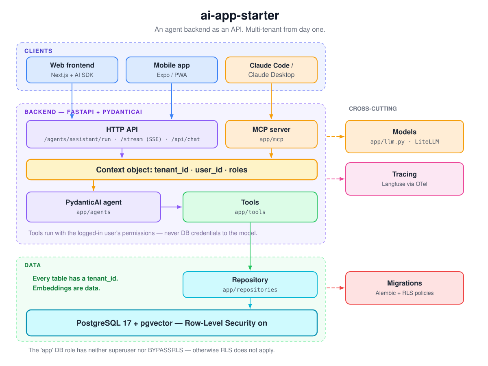

# ai-app-starter

Prototype an AI-agent app today without closing a single door for tomorrow.

This is a working agent backend — FastAPI + PydanticAI behind an HTTP API — that treats the web frontend, a mobile app, and Claude Code as three clients of the same interface. It is multi-tenant from day one without getting in your way while there is only one tenant, and everything vendor-shaped (model, gateway, tracing) sits behind an interface you can swap.

<p align="center">
  
</p>

<p align="center"><sub><a href="https://excalidraw.com/#json=HVEtqjokzG5Qtgyo6uulN,5FEngHdy0vyeKAv4jYPyZg">Open and edit the diagram in Excalidraw</a></sub></p>

> **As of 2026-08** (PydanticAI 2.x, MCP SDK 2.x, FastAPI 0.14x). Before deriving a project,
> run `uv lock --upgrade` and update the model names in `.env.example` and
> `docker/litellm/config.yaml`.

---

## The idea in four sentences

The agent logic runs as its own service with an HTTP API — web, mobile, and Claude Code are just three clients of the same interface. Every request produces a **context object** (`tenant_id`, `user_id`, roles) that is passed through agent, tools, repository, and down into the database transaction; nothing reads global state. In the database, **Row-Level Security** enforces tenant separation — not developer discipline. And the agent never sees a DB connection: it reaches data exclusively through tools that run with the logged-in user's permissions.

## Quickstart

```bash
uv sync --group dbtest              # dbtest only if you want the real RLS test
cp .env.example .env                # add keys and model names
docker compose up -d postgres
uv run alembic upgrade head
uv run python scripts/seed.py "My Tenant" me@example.com   # prints tenant/user IDs
uv run uvicorn app.main:app --reload
```

First call (dev headers are enough locally):

```bash
curl -X POST localhost:8000/agents/assistant/run \
  -H 'Content-Type: application/json' \
  -H 'X-Tenant-Id: <TENANT>' -H 'X-User-Id: <USER>' \
  -d '{"prompt": "What do my documents say about notice periods?"}'
```

Tests: `uv run pytest` — the RLS integration test is skipped when `pgserver` is missing.

## What's inside

| Building block | File | Purpose |
|---|---|---|
| Context object | `app/context.py` | `tenant_id`, `user_id`, roles — passed through everywhere |
| Auth (dev) | `app/deps.py` | `X-Tenant-Id`/`X-User-Id` headers locally; JWT slot prepared |
| Tenant session | `app/db/session.py` | `set_config('app.tenant_id', …)` per transaction |
| Schema + RLS | `migrations/versions/0001_initial.py` | tenants, users, documents (vector 1536), policies, grants |
| App role | `docker/postgres/01-init.sh` | `app` without superuser/BYPASSRLS — otherwise RLS is void |
| Repository | `app/repositories/documents.py` | the only path to the DB, vector search |
| Tools | `app/tools/documents.py` | context-aware search, shared by agent and MCP |
| Agent | `app/agents/assistant.py` | PydanticAI agent, model resolved at runtime, tracing metadata |
| API | `app/api/` | `/agents/assistant/run`, `/agents/assistant/stream` (SSE), `/api/chat` (Vercel AI SDK) |
| MCP server | `app/mcp/server.py` | the same tools for Claude Code / Claude Desktop |
| Models | `app/llm.py`, `app/embeddings.py` | provider abstraction, LiteLLM option |
| Tracing | `app/observability.py` | Langfuse via OTel (optional) |
| Tests | `tests/` | unit (TestModel, no DB) + a real RLS test against embedded Postgres |

## The four rules that hold it together

1. **Every new table gets a `tenant_id`** — plus an index, `FORCE ROW LEVEL SECURITY`, and a
   policy on `current_setting('app.tenant_id')`. Template and checklist live in
   `migrations/versions/0001_initial.py` and `migrations/script.py.mako`.
2. **The app connects as the `app` role** — no superuser, `NOBYPASSRLS`. Migrations and seed
   run via `DATABASE_URL_MIGRATIONS`. Break this rule and RLS is void — and the bug only
   surfaces with the second tenant.
3. **DB access only through repositories**, agent access only through tools. Tools return what is
   needed — everything returned ends up in the prompt at the model provider.
4. **Embeddings are data.** They live in the same table under the same policy, and cache keys
   include the `tenant_id`.

In full, with commands and conventions: [`CLAUDE.md`](CLAUDE.md).

## Make it your own

1. Copy the repo (`degit`, "Use this template", or clone without `.git`); replace the name in
   `pyproject.toml`, `CLAUDE.md`, and `.env.example`.
2. Write `docs/adr/0001-architecture.md` — template at `docs/adr/adr-template.md`, a filled-in
   example in the skill repo.
3. Set `LLM_MODEL` and `EMBEDDING_MODEL`. **Careful:** the embedding dimension is baked into the
   migration — switching models means a new migration.
4. Add your domain tables as a new migration; work through the checklist in `script.py.mako`.
5. Add tools in `app/tools/`, extend the MCP server, adjust the agent instructions.
6. Attach clients: [`docs/frontend.md`](docs/frontend.md) (Next.js),
   [`docs/mobile.md`](docs/mobile.md) (Android/iOS), [`docs/deployment.md`](docs/deployment.md).
7. **Implement `AUTH_MODE=jwt` before anything is publicly reachable.** The dev headers are for
   localhost and nowhere else.

## Deliberately not included

| | Why |
|---|---|
| Frontend | Moves too fast to freeze here — `docs/frontend.md` describes how to attach one |
| LangGraph | Only once an agent truly needs a state machine with checkpoints — then as its own module, with an ADR |
| Langfuse compose | Use Langfuse's official compose file, see `docs/deployment.md` |
| Onboarding/billing | Arrives with the second customer, not before |

## Where it comes from

This repo is the code half of a pair: **[ai-app-blueprints](https://github.com/JulesCyb/ai-app-blueprints)**
is the Claude Code skill that makes the architecture decision and writes the ADRs — this repo is
the scaffold it rolls out afterwards. Both work on their own, too.

## What we decided against — and why

The stack is the outcome of an August 2026 research pass (sources and full text:
[skill repo](https://github.com/JulesCyb/ai-app-blueprints), `references/`). What stayed out
matters as much as what went in:

| Decided against | Why |
|---|---|
| **TypeScript full-stack** (Next.js + Mastra/AI SDK as the backend) | The team is Python-strong, and the AI ecosystem (RAG, evals, data pipelines) has a multi-year head start in Python. TypeScript stays at the UI edge — the common production pattern is a Python backend + TS frontend. A pure TS stack only pays off when the chat UI *is* the product and the backend stays thin. |
| **A managed platform now** (Bedrock AgentCore, Azure AI Foundry) | Overhead and lock-in an own project does not need. Because the agent logic sits behind its own API and the tools speak MCP, the move there stays open — for client projects on AWS/Azure it is the intended path. |
| **Self-hosting the models** | Pays off with strict compliance or high, predictable throughput — neither applies here. Break-even vs. APIs comes only at very high volume. GDPR is covered via EU regions + DPA. |
| **A dedicated vector DB** (Pinecone, Weaviate, Qdrant) | pgvector in the same Postgres carries you into the range of 5–50M vectors, and the DB choice is only 5–10% of RAG quality. One database means one RLS story for data *and* embeddings, one backup, one thing to operate. |
| **LangGraph as the default** | Roughly 40% of "agent" tasks are a single model call with structured output. PydanticAI with tools covers most of the rest; LangGraph joins per agent only when a real state machine is needed (checkpoints, human-in-the-loop) — with an ADR. |
| **Local models in the product** | Models run behind the API (Claude/GPT/Bedrock/Azure). On-device or local only for development — or if self-hosting ever becomes mandatory. |
| **CrewAI, smolagents, LangChain Classic, AutoGen/Semantic Kernel separately** | Losers of the 2025/26 framework consolidation: opaque or expensive in multi-agent pipelines, not enterprise-ready, or superseded by their successors (LangGraph, Microsoft Agent Framework). |
| **OpenAI Assistants API** | Sunset on 2026-08-26 — new builds belong on the Responses API, or behind your own provider abstraction. |
| **A low-code core** | An exclusion criterion from the start: the product is developed with AI coding agents in the CLI, which needs code, conventions, and a `CLAUDE.md` — not click paths. |

Short version: **portable beats powerful.** Any dependency that can hide behind an API, a tool,
or MCP may be swapped later — any that cannot was avoided.

## License

[MIT](LICENSE)
